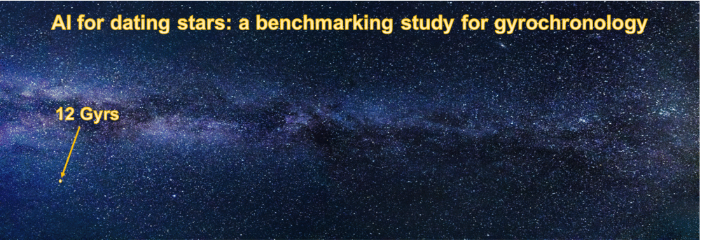

# AI for dating stars: a benchmarking study for gyrochronology

<p align="center">
  
</p>

This repository contains data and code accompaning our paper: [AI for dating stars: a benchmarking study for gyrochronology](https://gram.web.uah.es/data/publications/ai4space-cvpr21w-moya.pdf). It includes code for running all regression models developed for each of the Benchmarks described in the paper.


### Content

  * [Citation](#citation)  
  * [Dependencies](#dependencies)
  * [Data](#data)
  * [Usage](#usage)
    * [Training and testing](#training-and-testing)
    * [Testing with pretrained models](#testing-with-pretrained-models)
  * [Contact](#contact)


### Citation

If you find anything of this repository useful for your projects, please consider citing our work:

```bibtex
@inprocceedings{ai4dscvpr2021w,
	author  = {A. Moya and J. {Recio-Marti\'inez} and R.~J. {L\'opez-Sastre}},
	title   = {AI for dating stars: a benchmarking study for gyrochronology},
  	booktitle = {1st Workshop on AI for Space, CVPR},
	year	= {2021},	
}
```

### Dependencies
The project has been developed with the following packages: 
- python 3.8
- numpy 1.19.5
- pandas 1.2.1
- matplotlib 3.3.3
- scikit-learn 0.24.1


### Data

The folder `datasets` contains the two main datasets of the project:

- `gyro_tot_v20180801.txt`:  
  Data sample of 1464 stars with accurate ages coming from asteroseismology or cluster belonging. Used to perform the training of the models of all Benchmarks and testing these  models in Benchmarks A and B.  

- `test_gyro.txt`:  
  Control data sample of novel non-clustered 32 stars, including the Sun, to examine the age estimation performance of all the models in the Benchmark C.


### Usage  

After cloning or downloading the repo, you can choose between training and testing our models to reproduce our results or testing with some pretrained models, using our models or your own pretrained models.

#### Training and testing  
  
To reproduce our results, training and testing our models, you just have to run the following command in the folder `code/training_testing/`, taking into account the desire Benchmark:

```bash
python train_test_Benchmark_A.py
```
This script evaluates the different regression models following a classical training/test data splitting scheme. From the data sample distribution `datasets/gyro_tot_v20180801.txt`, we release a training set and a testing set, where 80 % and 20 % of the stars have been randomly included, respectively.

```bash
python train_test_Benchmark_B1.py 
```
The second one evaluates the generalization capability of models, where we train the approaches on young stars, and evaluate their performance on old stars. 

```bash
python train_test_Benchmark_B2.py
```
This is the script of a second scenario to evaluate the generalization capability of the models when they are trained only with stars belonging to clusters or only with field stars.

```bash
python train_test_Benchmark_C.py
```
The last one examines the age estimation performance of all the models on a control data sample `datasets/test_gyro.txt`, composed only of stars not belonging to any cluster, and with a more realistic age distribution.

#### Testing with pretrained models

To evaluate your own pretrained models, it's necessary to put these models in the folder `models/`, where are released our models, and correct the file name in each of the scripts. After that, you just have to run the following scripts in the folder `code/testing/`:
```bash
python testing_Benchmark_A.py
python testing_Benchmark_B1.py
python testing_Benchmark_B2.py
python testing_Benchmark_C.py
```

### Contact

For any question, you can open an issue or contact:

- Jarmi Recio Martínez: jarmi.recio@edu.uah.es

